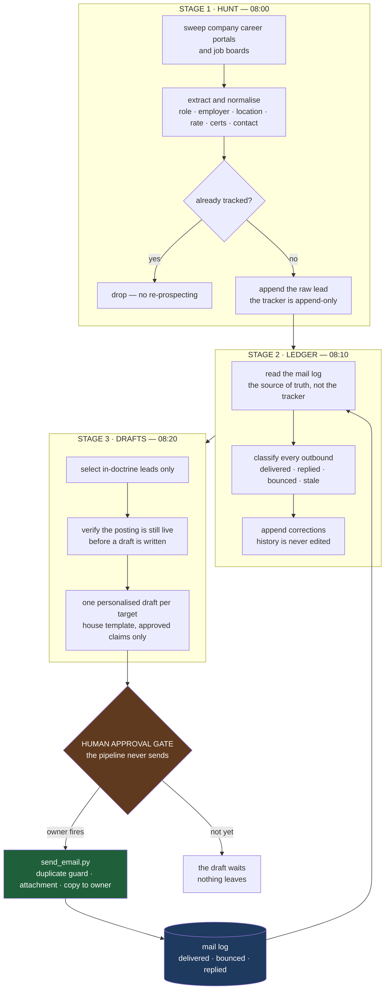

# op-scout-campaign

**An autonomous outbound sales pipeline.** Three chained agents prospect, verify, qualify and draft
outreach; a human approves and fires every message. It runs unattended on a daily schedule against a
live inbox, and it has been doing so in production since July 2026.

This is the standard top-of-funnel business-development motion — find prospects, qualify them, reach
out personally, follow up, keep the record straight — with the mechanical parts given to agents and the
judgement left with the owner.

---

## The funnel, and who does what

| Step | What happens | Who |
|---|---|---|
| **1 · Prospect** | Sweep company career portals and job boards for newly posted opportunities; normalise title, employer, location, duration, day rate, required certifications and contact route | Agent |
| **2 · Verify** | Confirm the posting is still live, resolve a real contact address, check the domain resolves, reject suspect listings | Agent |
| **3 · Qualify** | Apply the targeting doctrine — role match, engagement type, geography, and explicit exclusion rules | Agent |
| **4 · Draft** | Write one personalised message per target from a house template, with capability claims drawn only from an approved list | Agent |
| **5 · Approve** | Review the drafts and the proposed recipients. Nothing has been sent at this point, and nothing can be | **Human** |
| **6 · Send** | One sender script: attachment handling, a copy to the owner, and a duplicate-fire guard | Human-triggered |
| **7 · Record** | Append to the tracker, then reconcile the tracker against the mail log and publish the true state of every lead | Agent |

---

## Architecture



Note the loop at the bottom: the mail log feeds the reconciliation stage, which feeds the next day's
selection. The system's view of reality is refreshed from evidence every morning rather than from its
own memory.

---

## Why it is built this way

**Three stages, not one prompt.** It began as a single long agent prompt and it kept failing —
the local model could not hold the whole job and reliably emit tool-call JSON at the same time. Split
into three narrow jobs, each with one clear output and one verifiable state file, it has run without
that class of failure since. That is a deliberate cost: three scheduled jobs and a handoff, bought in
exchange for reliability.

**Handoff is context, not trust.** Each stage receives the previous stage's report as injected context
and is instructed to treat it as a *hint to verify*, never as fact. An error upstream cannot silently
become a message to a client.

**The mail log is the source of truth.** A tracker maintained by an agent drifts. A mail log does not.
Every deduplication decision, every status report, and every answer to "have we contacted them before?"
is settled by reading the log, not by reading the notes.

**Append-only state.** No stage may edit or delete a tracked row; corrections are appended as new rows
with a reason. The record of what the system believed, and when, survives.

**The model never sends.** The pipeline's authority ends at the draft. Outbound contact with a company
is a human decision, every time — because the cost of one wrong message is higher than the cost of one
manual click.

**No fabricated claims, enforced in the prompt.** The capability lines in a drafted message come from an
approved list, copied exactly. The prompt states the reason: an invented credential in an application
email is a career event, not a typo.

**Idempotency, after a real incident.** `send_email.py` reads the mail log for an identical
(recipient, subject) pair and refuses to send unless explicitly overridden. It was written the day a
double-send happened.

---

## In production

| | |
|---|---|
| Outreach emails sent | **155** across **84** distinct recipients |
| Period | 21 Jul 2026 → 20 Sep 2026, daily schedule |
| Opportunities tracked | **121** rows in an append-only lead table |
| Hard bounces caught by reconciliation | **16**, surfaced as a work item instead of silently rotting in a list |
| Operator effort per day | read the board, read up to three drafts, say fire or not |

The numbers are aggregates. No contact data, target list or campaign record is published in this
repository — that material is the operator's, not the portfolio's.

---

## What this is, honestly

- **Built for one operator's own pipeline, not as a product.** There is no web UI, no multi-tenancy, no
  database. The CRM is a markdown table; that was a deliberate choice, not a shortcut left unfinished.
- **The sender is generic; the qualification doctrine is domain-specific.** The stage-3 selection rules
  encode one industry's targeting logic. The *pattern* — prospect, verify, qualify, draft, gate, send,
  reconcile — transfers to any outbound motion; the rules do not.
- **No sequencing or deliverability tooling.** There is no drip campaign, no open tracking, no warm-up
  logic. One message per prospect, sent once, with bounce detection.
- **The failure modes are documented, not hidden** — see the prompts in `references/`.

---

## Files

| File | Purpose |
|---|---|
| `send_email.py` | The sender. Model-proof, so any agent on any model can trigger it. Reads the credential from the environment, refuses duplicate sends, refuses a body file that still carries `To:`/`Subject:` headers |
| `references/stage-prompts.md` | All three production stage prompts, published as a case study in multi-agent orchestration — with the reasoning annotated |
| `.env.example` | Environment template. The key goes here, never in code |

## Setup

```bash
pip install requests
cp .env.example .env          # then fill in AGENTMAIL_KEY

python send_email.py \
  --to someone@company.com \
  --cc owner@example.com \
  --subject "..." \
  --body-file body.txt \
  --attach cv.pdf
```

Exit codes: `0` sent · `1` send failed · `2` blocked as a duplicate.

The three stages run as scheduled agent jobs (see `references/stage-prompts.md`). Each expects a
markdown tracker for state and an AgentMail inbox for the log; both are described in the prompts.

## Licensing

MIT + [The Commons Clause](LICENSE) — free to use; if you make money from it, share back.
